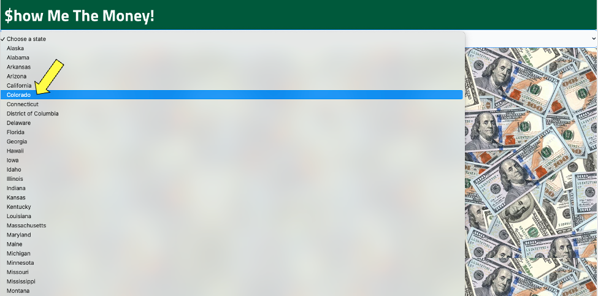

# Interactive-Front-End-Application-$how Me The Money!

## Project Description:
* This team successfully created an interactive front-end application 
* You can search for government representatives and see how much money they’ve raised. 
* This application was accomplished using Pro Publica Campaign Finance and Congress APIs and the following code:
    * 57.8% HTML
    * 14.1% CSS
    * 20.4% JavaScript

 

#### You can access this project via [GitHub]()

 

## Mock Up:

 

## How It Works:
First, you are brought to a landing page showing a dropdown of the 50 states of America.

 

Then, you can click into the dropdown and choose a state.

 

Next, an alphabatized list of the respective state government representatives populates on the page.

 

Click on any you'd like and see how much money they've raised.

 

Lastly, you can click on the buttons to register to vote or discover when and where the next elections are near you!

 

## Credits:
* [Neel Kakarala](https://github.com/kakaralan)
* [Alice Nutt](https://github.com/Ali-Kat96)
* [Robert Arn](https://github.com/rarn92)
* [Brian Lalli](https://github.com/BrianLalli)
* [Mitchell Merka](https://github.com/levmerka)

 

## Bugs:

 

## Future Development:

 

## Wireframe:

## Sources:
[jQuery](https://api.jquery.com/addclass/) | [Moment](ttps://momentjs.com/docs/#/displaying/) | [Chart JS](https://www.chartjs.org/docs/latest/getting-started/) | [GitHub](https://github.com/sgratzl/chartjs-chart-geo) | [US Capitals](https://www.thespreadsheetguru.com/blog/list-united-states-capitals-abbreviations) | [YouTube](https://www.youtube.com/watch?v=5xRVrwFNojk&feature=youtu.be) | [YouTube](https://www.youtube.com/watch?v=pFuibt5HNog) | [Heroku](https://salty-mountain-68764.herokuapp.com/) | [Adobe Color](https://color.adobe.com/explore) | [FlowBite](https://flowbite.com/docs/forms/search-input/) | [TailWind](https://tailwindcss.com/docs/installation/play-cdn) | [Pro Publica Finance API](https://www.propublica.org/datastore/api/campaign-finance-api) | [Pro Publica Congress API](https://www.propublica.org/datastore/api/propublica-congress-api) | [Federal Election Commission API](https://api.open.fec.gov/developers/) | [Open Secrets](https://www.opensecrets.org/federal-lobbying/top-recipients) | [Bulma Docs](https://bulma.io/documentation/overview/start/#docsNav) | [Bulma Buttons](https://bulma.io/documentation/elements/button/) | [Bulma Dropdown](https://bulma.io/documentation/components/dropdown/) | [Bulma Footer](https://bulma.io/documentation/layout/footer/)

 

## MIT License:

Copyright (c) 2022 Brian Lalli
